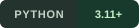
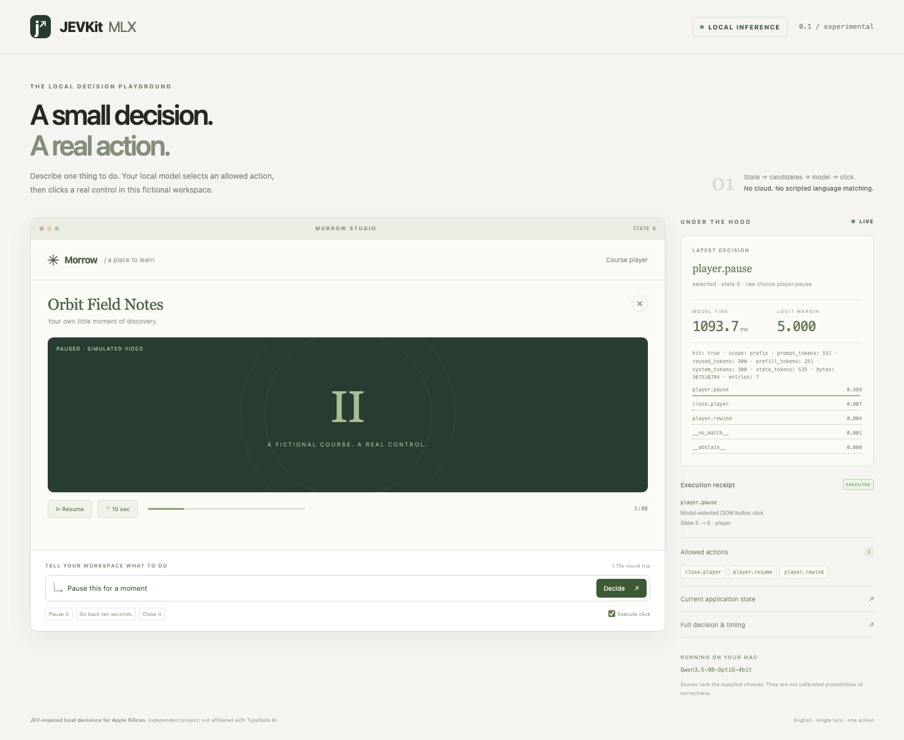

<p align="center"><strong>简体中文</strong> · <a href="README.en.md">English</a></p>

<p align="center">
  
</p>

<p align="center"><strong>当前状态 + 一句话 → 一个允许的选择。</strong><br />受 JEV 启发，为 Apple Silicon 构建。</p>

<p align="center">
  
  
  <a href="LICENSE.zh-CN.md"></a>
  <a href="CHANGELOG.zh-CN.md"></a>
</p>

<p align="center">
  <a href="#quick-start">快速开始</a> ·
  <a href="#results">实测结果</a> ·
  <a href="docs/testing.zh-CN.md">怎么测试</a> ·
  <a href="#replay">静态演示</a> ·
  <a href="#connect">联系</a>
</p>

<p align="center">
  <a href="https://xhslink.com/m/18bjTTf180W"></a>
  <a href="https://x.com/YetAnotherLeo"></a>
</p>

---

## 把自然语言接进你的应用

**MLXJ** 根据当前应用状态、用户的话和动态候选动作，让本地模型选出一个稳定的业务 ID；没有合适选项时，可以返回“不匹配”或“需要澄清”。

它适合嵌入你已有的工具：切换一个入口、选择当前列表里的内容、暂停播放器，或做一个 boolean / enum 判断。模型在 Mac 上运行，权重由你选择；无需先训练新模型。

> **命名预览：** MLXJ 是本次首页的候选名称。当前可运行代码的发行包与命令仍为 `jev-mlx`，Python 导入为 `jev_mlx`。0.1 是实验版，尚未公开发布到 PyPI。

| 能力 | 在应用里意味着什么 |
| :--- | :--- |
| **动态候选** | 页面变了，允许动作跟着变；业务 ID 由应用定义。 |
| **明确拒绝** | `no_match` 和 `abstain` 是正式结果，不必把每句话硬变成操作。 |
| **版本保护** | 推理期间状态变化，旧结果不能拿去执行；执行授权只能使用一次。 |
| **前缀复用** | 复用稳定上下文，每句新话仍实际推理；不缓存最终答案。 |
| **便于接入** | 提供 Python API、CLI 和 localhost HTTP 服务。 |

模型会犯错。候选分数用于排序，**不是经过校准的正确概率**；状态保护也不能替代语义判断。

<a name="quick-start"></a>

## 快速开始

需要 **Apple Silicon Mac、原生 ARM Python 3.11+**，以及本地 MLX-LM 模型权重。建议先从已验证的 Qwen 检查点开始，具体版本见[支持模型](docs/models.zh-CN.md)。

在此仓库目录内安装：

```sh
python3 -m venv .venv
source .venv/bin/activate
python -m pip install -e '.[mlx]'
export JEV_MLX_MODEL=/absolute/path/to/your/local/mlx-model
```

```python
import os
from jev_mlx import Candidate, DecisionRequest, MLXDecisionEngine

engine = MLXDecisionEngine(os.environ["JEV_MLX_MODEL"])
result = engine.decide(DecisionRequest(
    state={"focused_window": "notes"},
    utterance="Close it",
    candidates=(Candidate("close.notes", "Close the open notes window"),),
    state_version=1,
))

print(result.status, result.candidate_id)
print(result.margin, result.timing)
```

命令行使用同一份请求约定：

```sh
jev-mlx decide --request examples/decision.json
```

返回结果包含候选 ID、原始 logits、候选分数、margin、状态版本、模型身份、真实耗时和缓存信息。[Python API](docs/python-api.zh-CN.md) 包含 boolean 判断、状态更新与执行示例。

<a name="results"></a>

## 实测结果，连同局限一起公开

**新增六领域测试 · Apple M2 Max · 64 GiB · 36 个虚构英文场景。**

覆盖文档、日历草稿、文件列表、音乐队列、商品比较和设置。三个模型使用相同的冻结输入、提示词和阈值，每个模型比较四种输出方法。下面是直接评分结果：

| 本地检查点 | 严格正确 / 36 | 动作误选 / 30 | 同页新话语 p50 / p95 |
| :--- | ---: | ---: | ---: |
| Qwen3.5-9B-OptiQ-4bit | 30 / 36（83.3%） | 1 / 30 | 194.8 / 407.5 ms |
| Gemma 4 26B-A4B MoE | 31 / 36（86.1%） | 1 / 30 | 168.9 / 556.5 ms |
| GLM-4.7-Flash-4bit | 21 / 36（58.3%） | 8 / 30 | 170.6 / 330.5 ms |

36 题包含 30 个 enum 请求和 6 个 boolean 判断；动作误选只统计 enum。**这些是模型已加载、页面前缀可复用时的耗时**，不代表启动或任意页面上的请求速度。全部方法的准确率、拒绝率、动作覆盖率、布尔判断、内存和失败见[扩展评测报告](docs/extended-results.zh-CN.md)。

Gemma 选错了一次队列首项，Qwen 选错了一次最长续航产品；GLM 的动作错误更多。原来小样本中的零误操作没有延续到新场景。**当前结果不能支持无人确认的通用动作执行，也不代表任意模型兼容或固定 100 ms。**

<details>
<summary><strong>原始 28 题：保留此前结果</strong></summary>

**Apple M2 Max · 64 GiB · 28 条虚构英文测试场景 · 修订后的缓存实现。**

| 本地检查点 | 严格正确 | 动作误选 / enum 请求 | 同页面新话语 p50 / p95 |
| :--- | ---: | ---: | ---: |
| Qwen3.5-9B-OptiQ-4bit | **25 / 28（89.3%）** | **0 / 26** | **171.7 / 176.4 ms** |
| GLM-4.7-Flash-4bit | 14 / 28（50.0%） | 2 / 26 | 147.8 / 170.6 ms |
| Gemma 4 26B-A4B MoE · mixed 4/8-bit | 26 / 28（92.9%） | 1 / 26 | 134.9 / 283.9 ms |

准确率包含 26 个 enum 请求和 2 个 boolean 判断；动作误选只统计 enum。三行来自各自完整的测量记录，不能拼接为算法提速倍数。Gemma 的四种方法、三种缓存条件和全部失败见[专项报告](docs/gemma4-results.zh-CN.md)。

这里的时间要求**模型已经加载，且页面前缀可复用**。Qwen 在 KV 冷状态下的 p50 是 **2,159.9 ms**，页面更新后的首次决策是 **1,050.2 ms**，因此不能理解成每次请求都约 170 ms。

Qwen 在原始集的 3 个未通过场景包括拒绝状态区分和排序后的选项并列。Gemma 在“筛选后的第一个”上选错内容；GLM 也出现错误动作。原始集和扩展集分别报告，不合并为一个未见测试成绩。

</details>

- **161 项核心测试通过**：请求约定、状态更新、过期结果、单次执行授权、HTTP 等。它们不等于模型语义准确率。
- **168 / 168 原始场景缓存比较通过**：三个模型各 28 场景 × 2 种复用条件，和全新计算对照。
- **72 / 72 新场景缓存比较通过**：Gemma 另测 36 场景 × 2 种复用条件，最大 logit 与分数差均为 0；不代表没有语义错误。
- **浏览器记录完成 16 个场景检查**：包含真实 DOM 点击与执行回执；拒绝场景允许两种拒绝状态，标准与上面的严格质量集不同。

<details>
<summary><strong>我们具体怎么测？点击展开</strong></summary>

1. 从零编写原始 **16 条开发 + 28 条测试**，再增加独立的 **12 条开发 + 36 条测试**；冻结哈希，不导出任何生产数据。首版只验证英文输入。
2. 原始提示词在开发集调整后冻结。本次三个模型沿用同一提示词和阈值，没有根据新测试结果调整。
3. 比较直接候选评分、单编号、业务 ID JSON 和编号 JSON 四种方法；保留原始失败输出。
4. 分别记录进程启动、权重已加载但 KV 冷、同页面新话语、页面更新后首次决策。计时等待 MLX 计算完成。
5. 单独评估模型选择与执行器行为。执行器拦住错误，仍然是模型选错。

同一批 28 条场景在多个缓存条件下重复运行，不算更多独立样本。历史一编号基线达到 26/28，严格质量略高于直接返回结果；直接评分并未在所有质量和延迟指标上占优。补充 JSON 格式实验受早期测试发现启发，单独标注，不能当作完全未见的测试结果。

完整的 p50/p95、拒绝率、可执行覆盖率、内存、模型版本、输入规模、复现命令，以及原始缓存失败记录都在[中文测试说明](docs/testing.zh-CN.md)和[完整报告](docs/results.zh-CN.md)。不同代码版本的时间不能拼起来计算提速倍数。

</details>

<a name="replay"></a>

## 无需安装模型，也能看一次真实记录

提供一个**完全静态的录制回放**：选场景，查看当时的话语、候选、模型选择、耗时和实际执行回执。它读取已保存的测试记录，无服务器、无模型、无网络依赖。

**[打开静态回放文件](docs/demo/index.html?lang=zh-CN)** · [查看原始浏览器记录](docs/assets/browser-demo/browser-transcript.json)

GitHub 会把 HTML 文件显示为源码。克隆或下载仓库后，用浏览器打开 `docs/demo/index.html` 即可运行；也可以在确定公开仓库后托管到静态站点。

<details>
<summary><strong>查看真实浏览器截图与动态推理的区别</strong></summary>



截图和录制发生在项目更名前，保留原貌。静态回放不接受新的自由文本推理，也不重新操作桌面。真正输入新话语、让本地模型操作模拟页面，需要在 Apple Silicon 上启动 `jev-mlx serve`，具体步骤见[本地 HTTP 与浏览器集成](docs/http-and-demo.zh-CN.md)。

浏览器集成只操作这个虚构应用中预先允许的 DOM 控件，不是任意网站导航或视觉电脑操控。

</details>

## 它如何做出选择

```text
应用状态 + 自然语言 + 允许动作
              │
        官方 MLX-LM 模型
              │
       最后位置的候选 logits
              │
   selected(id) / no_match / abstain
              │
    应用校验版本 → 执行 → 回执
```

候选映射为经过 tokenizer 验证的单 token 编码，再映射回业务 ID。直接评分读取因果模型的下一 token logits，不生成 JSON 续写；没有重写官方量化输出头。混合缓存只保留完整、可复用的前缀边界。

实现细节见[架构](docs/architecture.zh-CN.md)与[官方框架审查](docs/framework-audit.zh-CN.md)。首版范围是**英文、单轮、单步选择**，不包含通用聊天、多步规划、任意参数生成、视觉理解、训练或 GPU 批处理。**中文文档不表示中文模型能力已经验证。**

## 继续阅读

| 文档 | 内容 |
| :--- | :--- |
| [中文测试说明](docs/testing.zh-CN.md) | 怎么测、测到了什么、失败在哪里、如何复现 |
| [Python API](docs/python-api.zh-CN.md) | enum / boolean、返回字段、版本化执行 |
| [支持模型](docs/models.zh-CN.md) | 检查点、量化、依赖、许可证与限制 |
| [评测方法](docs/evaluation.zh-CN.md) · [完整结果](docs/results.zh-CN.md) | 全部基线、原始记录、版本与失败 |
| [本地 HTTP](docs/http-and-demo.zh-CN.md) | CLI、接口和真实浏览器操作 |
| [贡献指南](CONTRIBUTING.zh-CN.md) · [发布说明](docs/releasing.zh-CN.md) | 开发、构建、发布边界 |

<details>
<summary><strong>运行开发检查</strong></summary>

```sh
python -m pip install -e '.[dev]'
python scripts/check_docs.py
python -m pytest -m 'not model'
python -m ruff check src tests benchmarks scripts examples
```

真实模型测试需要显式指定本地权重，顺序运行模型任务。GitHub CI 已配置，尚未声称远程 CI 通过。

</details>

<a name="connect"></a>

## 联系作者 · 支持项目

欢迎分享使用场景、复现结果和改进建议。你也可以通过提交 issue、修正文档或提供新的公开测试场景支持项目。

<p align="center"><strong>里奥YetAnotherLeo</strong><br />小红书号：<code>6236648830</code></p>

<p align="center"><a href="https://xhslink.com/m/18bjTTf180W">小红书 · 里奥YetAnotherLeo ↗</a> · <a href="https://x.com/YetAnotherLeo">X / Twitter · @YetAnotherLeo ↗</a></p>

<details>
<summary><strong>扫码关注小红书</strong></summary>

<p align="center"></p>

扫描名片上的二维码，在小红书找到我。

</details>

<p align="center"><sub>欢迎 Star、分享或提交 PR，一起改进本地语义决策。</sub></p>

## 许可证与来源

[MIT](LICENSE.zh-CN.md)。项目独立维护，受 [TypeSafe AI 的 JEV](https://docs.typesafe.ai/) 启发，使用官方 [MLX-LM](https://github.com/ml-explore/mlx-lm)。没有官方合作或背书，不使用 JEV 权重，也不声称复现未公开的 RLCD。

模型和依赖保留各自许可证；参考项目与归属见 [NOTICE](NOTICE.zh-CN.md)。已有实测材料保留更名前的名称、源文件路径和哈希，详见[结果来源说明](docs/results.zh-CN.md)。候选名称的检索记录见[命名说明](docs/naming.zh-CN.md)。

<p align="center"><sub>Local decisions. Visible evidence. Open source.</sub></p>
