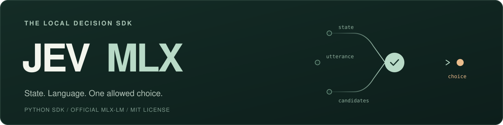

<p align="center">
  
</p>

<p align="center"><strong>JEV-inspired local decisions for Apple Silicon.</strong></p>

<p align="center">
  <a href="#quick-start">Quick start</a> ·
  <a href="docs/python-api.md">Python API</a> ·
  <a href="docs/results.md">Measured results</a> ·
  <a href="docs/architecture.md">How it works</a> ·
  <a href="CONTRIBUTING.md">Contribute</a>
</p>

---

JEV MLX is a small Python SDK for choosing an action from **current state,
natural language, and dynamic allowed choices**. Embed it in your own tools:
an existing local model returns a stable business ID, no match, or abstention.

```text
Application state + user utterance + allowed choices
                         ↓
                 Local MLX model
                         ↓
        selected(id) · no_match · abstain
```

| Your application supplies | JEV MLX returns |
|---|---|
| The current state and visible order | A ranked choice using that supplied context |
| Boolean or enum candidates, with stable IDs | A selected ID and typed value, or an explicit rejection |
| A versioned state snapshot | Scores, margin, model identity, measured timing, and cache details |

Model decisions can be wrong. `DecisionSession` adds version checks and single-use
execution authorization; scores rank candidates and are **not calibrated
probabilities of correctness**.

## Quick start

Requires **Apple Silicon**, native ARM **Python 3.11+**, and an existing local
MLX-LM checkpoint. Start with the verified Qwen checkpoint in the
[model table](docs/models.md). Weights remain external to the package.

From this checkout:

```sh
python3 -m venv .venv
source .venv/bin/activate
python -m pip install -e '.[mlx]'
export JEV_MLX_MODEL=/absolute/path/to/your/local/mlx-model
```

```python
import os
from jev_mlx import Candidate, DecisionRequest, MLXDecisionEngine

engine = MLXDecisionEngine(os.environ["JEV_MLX_MODEL"])
result = engine.decide(DecisionRequest(
    state={"focused_window": "notes"},
    utterance="Close it",
    candidates=(Candidate("close.notes", "Close the open notes window"),),
    state_version=1,
))

print(result.status, result.candidate_id)
print(result.margin, result.timing)
```

Use [the Python API](docs/python-api.md) for boolean decisions and versioned
execution. The CLI accepts the same request contract:

```sh
jev-mlx decide --request examples/decision.json
```

**0.1.0 is an experimental source release.** It has not been uploaded to PyPI.
A local wheel and source distribution can be built using the
[release instructions](docs/releasing.md).

## What is measured

Direct scoring on an **Apple M2 Max · 64 GiB · 28 fictional English test cases**,
using the revised cache implementation:

| Checkpoint | Exact decisions | False actions observed | Same-page p50 / p95 |
|---|---:|---:|---:|
| Qwen3.5-9B-OptiQ-4bit | **25 / 28** | 0 / 28 | **171.7 / 176.4 ms** |
| GLM-4.7-Flash-4bit | 14 / 28 | 2 / 28 | 147.8 / 170.6 ms |

Same-page timings use loaded weights and a cached page prefix with a fresh
utterance. Cold KV and changed-page decisions take longer. These are small-set
measurements, not latency or reliability guarantees. GLM is **not recommended
for automatic action execution with the current prompt**.

**145 core tests passed · 112/112 revised-runtime cache comparisons passed.**

The [full report](docs/results.md) includes model revisions, quantization,
dependencies, cold starts, one-code and JSON baselines, memory, all failures,
and reproduction commands. Original failed runs remain available. GitHub CI is
configured; no remote CI result is claimed.

## How it works

1. Encode each current candidate as a tokenizer-verified single token.
2. Use the official MLX-LM loader, model, and unchanged output head to score the
   candidates at the final prompt position.
3. Map the result back to the business ID, with no-match and abstention available.
4. Reuse complete stable-prefix snapshots; state changes invalidate dependent
   context, and sessions reject stale execution.

Every new utterance is evaluated. Direct scoring produces no JSON continuation;
it uses a causal model's next-token logits. The
[framework audit](docs/framework-audit.md) explains what is reused from MLX-LM,
and the [architecture](docs/architecture.md) documents the limits.

Version 0.1 focuses on **English, single-turn, single-step choices**. General
chat, arbitrary tool arguments, multi-step planning, training, vision, and GPU
batching are outside its scope. Other checkpoints require separate validation.

## Documentation

| Guide | What you will find |
|---|---|
| [Python API](docs/python-api.md) | Enum/boolean decisions, result fields, state updates, and execution |
| [Architecture](docs/architecture.md) | Scoring, cache boundaries, and versioned sessions |
| [Model compatibility](docs/models.md) | Exact checkpoints, revisions, licenses, and measured limitations |
| [Evaluation](docs/evaluation.md) · [Results](docs/results.md) | Reproducible methods, baselines, and complete evidence |
| [CLI, HTTP & browser example](docs/http-and-demo.md) | Service integration and an optional recorded validation example |
| [Contributing](CONTRIBUTING.md) · [Changelog](CHANGELOG.md) | Development workflow and release history |

The browser example is one integration test of the SDK. Its fictional desktop,
recording, and execution receipts live in the linked documentation.

## Develop

```sh
python -m pip install -e '.[dev]'
python -m pytest -m 'not model'
python -m ruff check src tests benchmarks scripts examples
```

Real-model tests and benchmarks are opt-in; see the
[evaluation guide](docs/evaluation.md). Run model workloads sequentially.

## License & inspiration

[MIT](LICENSE). Independently maintained, inspired by
[TypeSafe AI's JEV](https://docs.typesafe.ai/). No affiliation or endorsement,
no JEV weights, and no claim to reproduce unpublished RLCD training or model
architecture. Dependencies and weights retain their own licenses; attribution
and reviewed reference projects are listed in [NOTICE.md](NOTICE.md).
