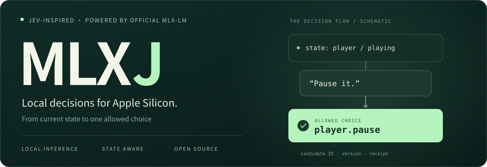
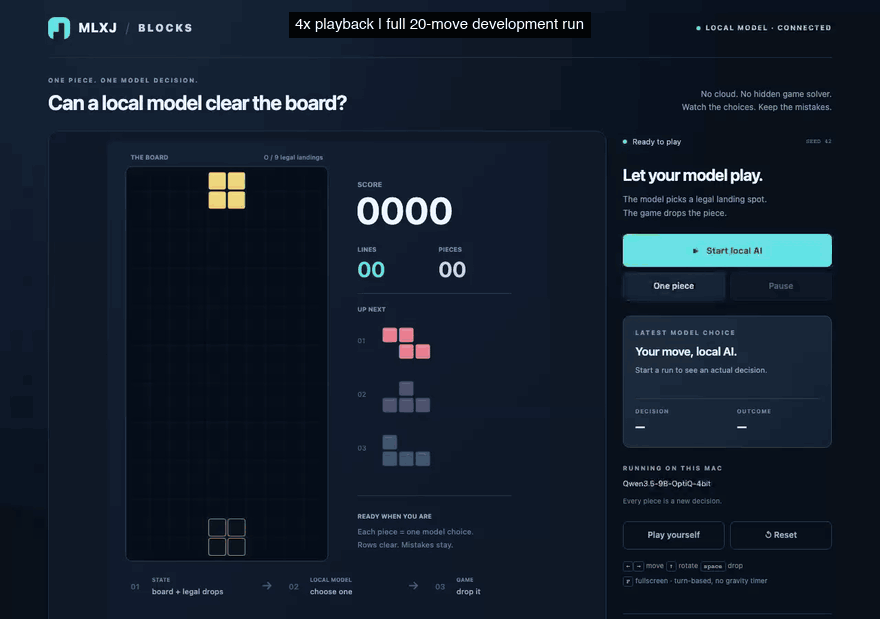

<p align="center">
  
</p>

<p align="center"><strong>Current state + a sentence → one allowed choice.</strong><br />JEV-inspired local decisions for Apple Silicon.</p>

<p align="center">
  
  
  <a href="LICENSE"></a>
  <a href="CHANGELOG.md"></a>
</p>

<p align="center">
  <a href="#quick-start">Quick start</a> ·
  <a href="#blocks">Game demo</a> ·
  <a href="#results">Measured results</a> ·
  <a href="docs/evaluation.md">Methodology</a> ·
  <a href="#connect">Connect & support</a>
</p>

<p align="center">
  <a href="https://x.com/YetAnotherLeo"></a>
  <a href="https://xhslink.com/m/18bjTTf180W"></a>
</p>

<p align="center"><strong>English</strong> · <a href="README.zh-CN.md">简体中文</a></p>

---

<a name="blocks"></a>

## A local model plays Blocks



**Qwen3.5-9B · 20 model-selected placements · 4 cleared rows · 400 points.** The GIF shows the entire second development run at **4× playback**, including inference waits. The model chooses from every legal vertical-drop placement using structured board data and rule-computed outcomes; there is no best-move fallback. This is turn-based play, not screenshot understanding or frame-by-frame control.

[Run the game locally](docs/blocks.md) · [Full-speed video](docs/assets/blocks/full-run.mp4) · [All decisions](docs/assets/blocks/attempt-2.json)

The first attempt refused to place a piece. Both attempts are retained in the [game report](docs/blocks.md#recorded-development-attempts). After clarifying the game instruction, the second run reached its planned 20-piece limit. Its decision p50 / p95 was **5.78 / 11.57 seconds**; this is an illustrative development run, not a held-out game benchmark or a speed claim. Manual play can run on a static server; new AI decisions require the local MLX backend.

## Connect language to your application

**MLXJ** uses the current application state, a user utterance, and dynamic allowed choices to select a stable business ID with a local model. No-match and abstention are explicit outcomes.

Embed it in an existing tool: open a feature, select a visible item, pause a player, or answer a boolean / enum question. Inference runs on your Mac with an existing checkpoint; no training is required.

> **Project and package:** The project is MLXJ. The distribution and CLI are `jev-mlx`, with Python imports from `jev_mlx`. Version 0.1 is experimental and has not been published to PyPI.

| Capability | What it means for your application |
| :--- | :--- |
| **Dynamic choices** | Update allowed actions with the page; keep your own stable business IDs. |
| **Explicit rejection** | Return `no_match` or `abstain` when an action is not appropriate. |
| **Version protection** | Reject stale decisions after state changes; consume execution authorization once. |
| **Prefix reuse** | Reuse stable context while evaluating every new utterance. Never cache final answers. |
| **Small integration surface** | Python API, CLI, and a localhost HTTP service. |

Models can make mistakes. Candidate scores rank choices and are **not calibrated probabilities of correctness**. State guards do not establish semantic correctness.

<a name="quick-start"></a>

## Quick start

Requires **Apple Silicon, native ARM Python 3.11+**, and a local MLX-LM checkpoint. Start with the verified Qwen checkpoint in the [model table](docs/models.md).

Clone the repository and install:

```sh
git clone https://github.com/CoderInPajamas/MLXJ.git
cd MLXJ
python3 -m venv .venv
source .venv/bin/activate
python -m pip install -e '.[mlx]'
export JEV_MLX_MODEL=/absolute/path/to/your/local/mlx-model
```

```python
import os
from jev_mlx import Candidate, DecisionRequest, MLXDecisionEngine

engine = MLXDecisionEngine(os.environ["JEV_MLX_MODEL"])
result = engine.decide(DecisionRequest(
    state={"focused_window": "notes"},
    utterance="Close it",
    candidates=(Candidate("close.notes", "Close the open notes window"),),
    state_version=1,
))

print(result.status, result.candidate_id)
print(result.margin, result.timing)
```

The CLI uses the same request contract:

```sh
jev-mlx decide --request examples/decision.json
```

Results include the candidate ID, raw logits, candidate scores, margin, state version, model identity, actual timing, and cache details. See the [Python API](docs/python-api.md) for booleans, state updates, and versioned execution.

<a name="results"></a>

## Measurements, with their limits

**New six-domain evaluation · Apple M2 Max · 64 GiB · 36 fictional English cases.**

Documents, calendar drafts, files, music queues, product comparisons, and settings. Three models receive the same frozen inputs, semantic prompt, and threshold, with four output methods each. These are the direct-scoring results:

| Local checkpoint | Exact decisions / 36 | Wrong actions / 30 | Same-page p50 / p95 |
| :--- | ---: | ---: | ---: |
| Qwen3.5-9B-OptiQ-4bit | 30 / 36 (83.3%) | 1 / 30 | 194.8 / 407.5 ms |
| Gemma 4 26B-A4B MoE | 31 / 36 (86.1%) | 1 / 30 | 168.9 / 556.5 ms |
| GLM-4.7-Flash-4bit | 21 / 36 (58.3%) | 8 / 30 | 170.6 / 330.5 ms |

The 36 cases contain 30 enum requests and six boolean decisions; action errors count enum requests only. **Timings require loaded weights and a reusable page prefix.** They do not describe startup or arbitrary new pages. See the [extended report](docs/extended-results.md) for every method, rejection and coverage rates, boolean quality, memory, and failures.

Gemma selected the wrong queue item; Qwen selected the wrong longest-battery product. GLM made more action errors. The earlier small sample's zero-error observation did not carry over to new cases. **These results do not establish reliable unattended actions, arbitrary-model compatibility, or fixed 100 ms performance.**

<details>
<summary><strong>Original 28 cases: previous results retained</strong></summary>

**Apple M2 Max · 64 GiB · 28 fictional English test cases · revised cache runtime.**

| Local checkpoint | Exact decisions | Wrong actions / enum requests | Same-page p50 / p95 |
| :--- | ---: | ---: | ---: |
| Qwen3.5-9B-OptiQ-4bit | **25 / 28 (89.3%)** | **0 / 26** | **171.7 / 176.4 ms** |
| GLM-4.7-Flash-4bit | 14 / 28 (50.0%) | 2 / 26 | 147.8 / 170.6 ms |
| Gemma 4 26B-A4B MoE · mixed 4/8-bit | 26 / 28 (92.9%) | 1 / 26 | 134.9 / 283.9 ms |

Accuracy includes 26 enum requests and two boolean decisions; action errors count enum requests only. These are separate recorded runs, not inputs to a cross-revision algorithm speedup claim. The [Gemma report](docs/gemma4-results.md) includes all four methods, three cache conditions, and every failure.

These timings require **loaded weights and a reusable page prefix**. Qwen's KV-cold p50 was **2,159.9 ms**; its first decision after a page update was **1,050.2 ms**. About 170 ms is not a per-request guarantee.

Qwen's three original-suite misses include rejection-status distinctions and a tied choice after reordering. Gemma selected the wrong filtered first item; GLM also produced incorrect actions. The original and extended sets are reported separately, not combined into one unseen-test score.

</details>

- **161 core tests passed:** contracts, state updates, stale decisions, single-use authorization, HTTP, and related behavior. These do not measure model semantics.
- **168 / 168 original-suite cache comparisons passed:** three models × 28 cases × two reuse conditions, each compared with fresh computation.
- **72 / 72 extended-suite cache comparisons passed:** Gemma's 36 new cases × two reuse conditions, with observed maximum logit and score differences of 0. Numerical agreement does not establish semantic correctness.
- **16 recorded browser scenarios checked:** actual DOM clicks and execution receipts. Decline cases accept either rejection outcome, unlike the strict quality set above.

<details>
<summary><strong>How was this tested?</strong></summary>

1. Write the original **16 dev / 28 test** cases and the separate **12 dev / 36 test** extension from scratch. Freeze their hashes; use no production exports. Version 0.1 validates English inputs only.
2. Freeze the original development-refined semantic prompt and threshold. This three-model campaign keeps them unchanged after seeing new test outputs.
3. Compare direct scoring, one-code generation, business-ID JSON, and option-code JSON. Retain every failed output.
4. Measure process startup, loaded weights with cold KV, a new utterance on the same page, and the first decision after a page update. Synchronize MLX work before stopping the timer.
5. Score model choice separately from execution. A guard blocking a bad action does not make the model correct.

Repeating 28 cases under several cache conditions does not create more independent samples. The historical one-code baseline reached 26/28, slightly better than the direct returned decision. Direct scoring did not dominate every quality and latency metric. A supplementary JSON-format experiment was informed by earlier test results and is explicitly labeled as such.

The [full report](docs/results.md) includes p50/p95, rejection, executable coverage, memory, versions, input sizes, reproduction commands, and original cache failures. Do not combine timings from different code revisions to calculate a speedup. See the [testing guide](docs/testing.md) for a step-by-step explanation.

</details>

<a name="replay"></a>
<a name="live-demo"></a>

<details>
<summary><strong>Developer integration example: browser actions and execution receipts</strong></summary>

The fictional Morrow Studio desktop demonstrates how to connect allowed actions to real DOM controls, validate state versions, and inspect execution receipts.

[Local setup and integration guide](docs/http-and-demo.md) · [Recorded eight-request walkthrough](docs/assets/live-demo/README.md) · [Original browser transcript](docs/assets/browser-demo/browser-transcript.json)

The [static evidence replay](docs/demo/index.html?lang=en) reads saved results without a model or server. Clone the repository and open `docs/demo/index.html` locally; GitHub displays HTML files as source. New requests require the local MLX service. This integration example controls allowlisted buttons in a fictional application; it does not navigate arbitrary websites.

</details>

## How a choice is made

```text
Application state + utterance + allowed choices
                       │
               Official MLX-LM model
                       │
           Final-position candidate logits
                       │
          selected(id) / no_match / abstain
                       │
       Application version check → execution → receipt
```

Choices map to tokenizer-verified single-token codes, then back to business IDs. Direct scoring reads a causal model's next-token logits without generating a JSON continuation. It retains the official quantized output head. Hybrid caches reuse only complete, valid prefix boundaries.

See the [architecture](docs/architecture.md) and [framework audit](docs/framework-audit.md). Version 0.1 focuses on **English, single-turn, single-step choices**. General chat, multi-step planning, arbitrary arguments, vision, training, and GPU batching are outside its scope. **Chinese documentation does not mean Chinese model behavior has been validated.**

## Documentation

| Guide | Contents |
| :--- | :--- |
| [Python API](docs/python-api.md) | Enum / boolean, result fields, and versioned execution |
| [Model compatibility](docs/models.md) | Checkpoints, quantization, dependencies, licenses, and limits |
| [Evaluation](docs/evaluation.md) · [Results](docs/results.md) | All baselines, raw evidence, versions, and failures |
| [Testing guide](docs/testing.md) | Methodology, results, and reproduction |
| [Local HTTP](docs/http-and-demo.md) | CLI, service, and actual browser operations |
| [Contributing](CONTRIBUTING.md) · [Releasing](docs/releasing.md) | Development, builds, and publication |

<details>
<summary><strong>Run development checks</strong></summary>

```sh
python -m pip install -e '.[dev]'
python scripts/check_docs.py
python -m pytest -m 'not model'
python -m ruff check src tests benchmarks scripts examples
```

Real-model tests require explicitly selected local weights. Run model workloads sequentially. GitHub CI runs core checks and distribution builds on Python 3.11 and 3.13; local MLX inference is verified separately.

</details>

<a name="connect"></a>

## Connect & support

Share use cases, reproduction results, and suggestions. Issues, documentation fixes, and new public test cases also support the project.

<p align="center"><strong>YetAnotherLeo</strong></p>

<p align="center"><a href="https://x.com/YetAnotherLeo">X / Twitter · @YetAnotherLeo ↗</a> · <a href="https://xhslink.com/m/18bjTTf180W">Xiaohongshu · 里奥YetAnotherLeo ↗</a></p>

<details>
<summary><strong>Scan the Xiaohongshu profile card</strong></summary>

<p align="center"></p>

Scan the profile QR to follow on Xiaohongshu.

</details>

<p align="center"><sub>Support the project with a star, a share, or a pull request.</sub></p>

## License & inspiration

[MIT](LICENSE). Independently maintained, inspired by [TypeSafe AI's JEV](https://docs.typesafe.ai/), and built on official [MLX-LM](https://github.com/ml-explore/mlx-lm). No affiliation or endorsement, no JEV weights, and no claim to reproduce unpublished RLCD.

Models and dependencies retain their own licenses; see [NOTICE](NOTICE.md). Recorded evidence retains former project names, source paths, and hashes as explained in [results](docs/results.md). See the [naming research](docs/naming.md) for the candidate name.

<p align="center"><sub>Local decisions. Visible evidence. Open source.</sub></p>
