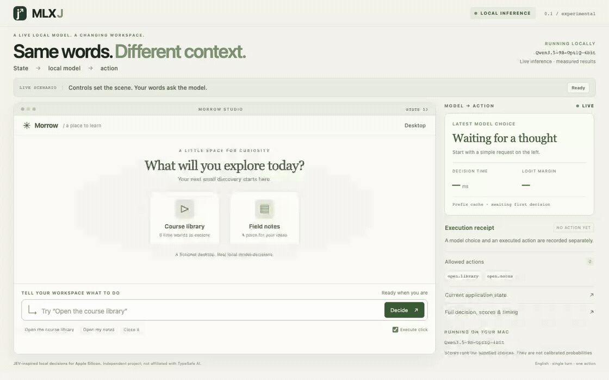

# Same words. Different context.

[Back to home](../../../README.md)

This is one continuous, real-model browser recording of JEV MLX's fictional Morrow
Studio desktop. It shows eight predetermined English requests, four labeled
manual setup clicks, and the actual model-selected DOM actions. It is an
illustrative walkthrough, not an independent quality or performance benchmark.

The **MLXJ** name visible in this recording predates the current JEV MLX name.
The rename did not involve re-recording or changing the original media or records.



[Full MP4](full-run.mp4) · [Original WebM](original.webm) ·
[Unchanged capture transcript](transcript.json) · [Media hashes](provenance.json)

## What happened

All eight model-choice and execution checks passed in this single attempt.
There were no browser JavaScript errors. The recording helper reported a video
finalization error after the requests; the complete raw video was recovered as
described below. No request was rerun to improve an answer or a measured time.

| Scene | Request | Raw model choice | Actual result | Decision time |
| --- | --- | --- | --- | ---: |
| Empty desktop | Close it | `__no_match__` | No action | 4,272.4 ms |
| Field notes open | Close it | `close.notes` | Notes closed | 1,811.7 ms |
| Science filter, Z–A order | First one | `play.orbit` | Orbit Field Notes opened | 2,061.8 ms |
| Player ready | Pause it | `player.pause` | Player paused | 2,617.9 ms |
| Paused player | Did you just close it? | `__no_match__` | Player unchanged | 1,176.1 ms |
| Player open | Close it | `close.player` | Returned to library | 277.6 ms |
| Library open | Close it | `close.library` | Returned to desktop | 302.2 ms |
| Empty desktop again | Close it | `__no_match__` | No action | 1,494.5 ms |

These are the individual `result.timing.decision_ms` values shown in the video,
not a latency distribution. Weights were loaded before recording; the first
decision had cold KV, most subsequent scenes reused the system prefix, and the
player/library close requests reused full state prefixes. Page changes and
screen recording make this a different workload from the benchmark. Typing,
manual setup, and deliberate reading pauses stay in the video but are excluded
from the backend decision timer. Startup is not shown or timed by this video.

The three decline scenes accept either `no_match` or `abstain` in the recording
assertions; this model returned `no_match` each time. That check is less strict
than the separately frozen quality evaluation. Guarding execution does not turn
a wrong model choice into a correct answer. See the [full testing guide](../../testing.md)
and [extended results, including failures](../../extended-results.md).

## Environment and provenance

- Captured on September 20, 2026 at 13:37 UTC; Apple M2 Max, 64 GiB RAM,
  macOS Darwin 25.6.0, arm64, Python 3.13.2.
- Local checkpoint: `Qwen3.5-9B-OptiQ-4bit`, actual mixed 4/8-bit quantization,
  group size 64. Complete config, tokenizer and quantization hashes are in the transcript.
- MLX 0.31.2, MLX-LM 0.31.3, Transformers 5.9.0, Tokenizers 0.22.2;
  Playwright 1.63.0 and its isolated Chromium context. No existing browser profile was used.
- Capture source commit: `11eafe7393da1cf9054d4d71146bd041cb1c2d60`.
  The working tree was clean when recording started. Runtime, UI and recorder
  file hashes remained unchanged during capture and are included in the transcript.
- Original WebM and MP4: 1280 × 800, 62.04 seconds. GIF: 1120 × 700, 10 fps,
  128 colors, 62.00 seconds (frame sampling), about 9.9 MB. FFmpeg 7.1.3.
  Both derivatives retain the full timeline at 1× speed, with no cuts, cropping,
  generated frames or substituted results. The MP4 is about 1.9 MB.

The desktop, course names, user requests and player are fictional public examples.
The player simulates playback state, not a downloaded video. Captions describe
the scenario and are never sent to the model. The integration selects existing
allowlisted buttons; it does not navigate arbitrary websites or generate JavaScript.
Raw evidence remains in its original English in both documentation editions.

## Video recovery, with the original error preserved

The first recorder closed the browser before calling Playwright's `video.save_as`.
That call failed, although closing the context had already finalized the full
raw WebM on disk. The original transcript still records the exception and
`video_saved: false`; it has not been rewritten to imply a flawless capture.

We copied that one raw file byte-for-byte to `original.webm`. The
[recovery manifest](video-recovery.json) records its SHA-256, the unchanged
transcript's SHA-256, the recovery method and the probed duration. It matches the
final recorded frame and all eight outcomes. Media conversion validates both
hashes. There was no second model attempt, editing of outputs, or removed waiting time.

The recorder now saves the video after closing its context and before closing
the browser. That lifecycle was verified with a separate blank-browser video
without invoking the model. The old error remains part of this published run.

## Reproduce

Follow the [local setup and recording commands](../../http-and-demo.md#interactive-showcase).
Use a new directory for every attempt and retain failures. The ordinary media
builder verifies a successful capture's video hash directly. To rebuild these
particular recovered assets with the included recovery record:

```sh
python scripts/build_showcase_media.py \
  --capture-dir docs/assets/live-demo \
  --recovery-manifest docs/assets/live-demo/video-recovery.json \
  --output output/playwright-showcase/rebuilt-media \
  --width 1120 --fps 10
```

This command only converts the existing video. New interactive decisions require
the local MLX service; the GIF and MP4 can be viewed as static files on GitHub.
